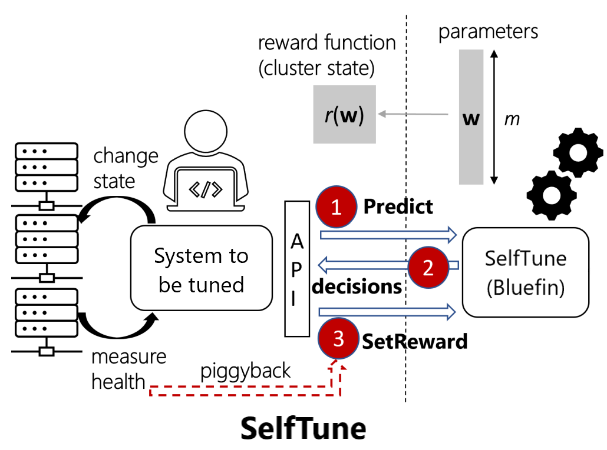
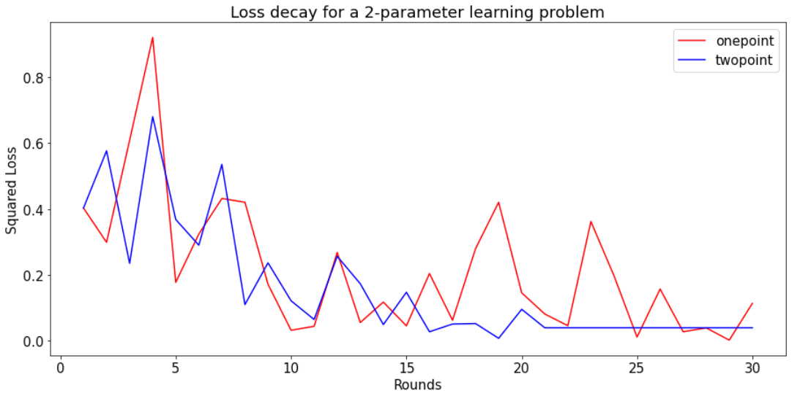
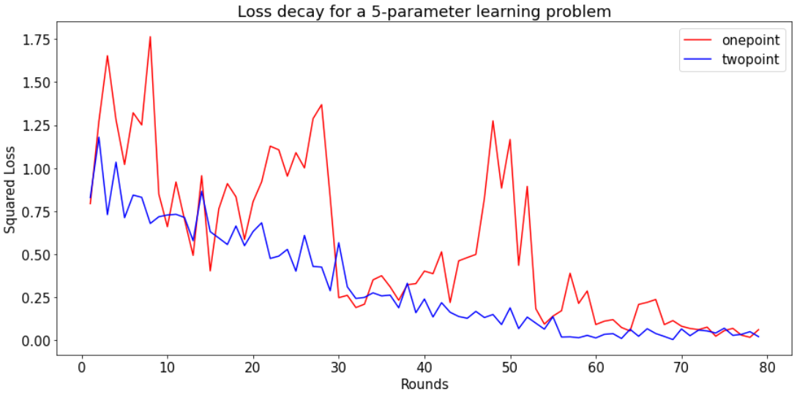

<p align="center">

</p>

<p align="center">
<a href="https://github.com/microsoft/SelfTune/blob/main/LICENSE"><strong>License</strong></a> •
<a href="https://github.com/microsoft/SelfTune/blob/main/SECURITY.md"><strong>Security</strong></a> •
<a href="https://github.com/microsoft/SelfTune/blob/main/SUPPORT.md"><strong>Support</strong></a> •
<a href="https://github.com/microsoft/SelfTune/blob/main/CODE_OF_CONDUCT.md"><strong>Code of Conduct</strong></a>
</p>

# SelfTune

SelfTune is an RL framework that enables systems and service developers to automatically tune various configuration parameters and other heuristics in their codebase, rather than manually-tweaking, over time in deployment. It provides easy-to-use API (Python, C# bindings) and is driven by bandit-style RL & online gradient-descent algorithms.

<h3>🔥We highly recommend you to check out <a href="https://github.com/microsoft/oppertune" target="_blank">OPPerTune</a> which is a successor to SelfTune. OPPerTune provides support for many more algorithms and will continue to receive updates.</h3>

## Installation and Usage

Refer to the [python README](python/README.md) and [C# README](c%23/README.md).

## Basic tour of the SelfTune package
In this section, we present the syntax and semantics of SelfTune's python bindings. These ideas apply to the C# bindings too. However, do note that some of the features in the python bindings(normalization, step size, optimizers, ...) may not be available in the C# bindings.

### 1. Identifying the reward function

SelfTune's optimization algorithm(e.g., Bluefin) uses a reward to compute a gradient-ascent style update to the parameter values. This reward can be any health or utilization metric of the current state of the system (e.g., throughput, latency, ...).

### 2. Defining the parameters to be tuned
We define the parameters of the system to be tuned to optimize the supplied reward. Our implementation currently supports tuning only *numerical* parameters (support for *categorical* parameters will soon be made available). The library allows optional arguments that encode domain knowledge for tuning the parameters:
* `type` - Type of the parameter. Can be `discrete`(only integer values) or `continuous`.
* `name` - The name of the parameter. The prediction returned by SelfTune will be a python dict with the name as the key and prediction as the value.
* `initial_value` - The initial value of the parameter</li>
* `lb` (optional) - The lower bound value that the parameter can take. (Equivalent to c_min in version 1.0.0)
* `ub` (optional) - The upper bound value that the parameter can take. (Equivalent to c_max in version 1.0.0)
* `step_size` (optional) - If a step_size is provided, the parameter moves in steps of the step_size. For example, in the below example, the valid `p2`
values will be `(100.0, 200.0, 300.0, ... 900.0)`.

```python
import numpy as np

from selftune_core import SelfTune

parameters = (
    {
        "type": "discrete",
        "name": "p1",
        "initial_value": 5,
        "lb": 0,
        "ub": 10,
    },
    {
        "type": "continuous",
        "name": "p2",
        "initial_value": 100.0,
        "lb": 100.0,
        "ub": 900.0,
        "step_size": 100.0,
    },
)
```

### 3. Create an instance of SelfTune
Once we define the parameters to be tuned, we can create an instance of the parameter learning problem for SelfTune. Below is a description of the model hyperparameters.

- <strong>algorithm</strong> - The optimization algorithm to use. Currently, we only support the `bluefin` algorithm.
- <strong>parameters</strong> - The parameters to tune.
- <strong>feedback</strong> - The type of feedback update. The feedback can be either `onepoint` or `twopoint`. `onepoint` is recommended when the reward function changes with time i.e., it is not possible to query the reward function at the same set of parameters twice and expect the same reward. In settings (e.g., simulations) where it is possible to obtain the reward at two different sets of parameters, `twopoint` is prefered since it is more sample-efficient and converges faster.

Along with the above arguments, the user can also optionally provide
- <strong>eta</strong> - The learning rate. 
- <strong>delta</strong> - The exploration radius.
- <strong>optimizer</strong> - The optimizer to use. Can be ("sgd", "rmsprop").
- <strong>optimizer_kwargs</strong> - Optimizer specific arguments. For example, for the rmsprop optimizer, optimizer_kwargs can be `{"alpha": 0.99, "momentum": 0, "eps": 1e-8}`
- <strong>random_seed</strong> - The random seed used to initialize the numpy pseudo-random number generator.
- <strong>eta_decay_rate</strong> - The decay rate of eta. 
- <strong>normalize</strong> - Specifies whether the parameter values have to be normalized. Uses min-max normalization.


```python
st = SelfTune(
    algorithm="bluefin",
    parameters=parameters,
    algorithm_args=dict(
        feedback="twopoint",
        eta=0.01,
        delta=0.1,
        random_seed=4,
    ),
)
```

The user can also modify the value of eta after each round. For example,
```python
def eta_decay(inital_eta, curr_round, decay_rate):
    return (decay_rate**curr_round)*initial_eta

num_rounds = 100
decay_rate = 0.95
initial_eta = 0.01

st = SelfTune(
    algorithm="bluefin",
    parameters=parameters,
    algorithm_args=dict(
        feedback="onepoint"
    ),
)

for round in range(1, num_rounds):
    model.eta = eta_decay(initial_eta, round, decay_rate)
    model.delta = model.eta**0.5
```

In cases where both `onepoint` and `twopoint` feedback are applicable, it is recommended to use `twopoint`. `twopoint` provides more stable convergence and more accurate gradient estimates compared to `onepoint`.

<table>
    <tr>
        <td>
            <p align="center">
                
            </p>
        </td>
        <td>
            <p align="center">
                </td>
            </p>
    </tr>
</table>

### 4. Predict, Set Reward
Now that we have set up an instance of SelfTune, we can call `model.predict` to get the current set of parameters. Once the reward is available, it can be sent back to SelfTune using `model.set_reward`. In the plots comparing `onepoint` and `twopoint` feedback, we use the negative squared loss as the reward function.

```python
num_rounds = 100
for i in range(num_rounds):
    # Get the current set of parameters
    pred = st.predict() # pred = {"p1": 6, "p2": 200.0}

    # Receive feedback
    reward = black_box_reward(pred)

    # Send the feedback to SelfTune for the gradient update
    st.set_reward(reward)
    
    if i % 5 == 0:
        print(
            f'Round={i}, Reward={reward}, Pred=({pred[0]:.4f}, {pred[1]:.4f}), Best=({st.center[0]}, {st.center[1]})'
        )
```

## Contributing

This project welcomes contributions and suggestions.  Most contributions require you to agree to a
Contributor License Agreement (CLA) declaring that you have the right to, and actually do, grant us
the rights to use your contribution. For details, visit https://cla.opensource.microsoft.com.

When you submit a pull request, a CLA bot will automatically determine whether you need to provide
a CLA and decorate the PR appropriately (e.g., status check, comment). Simply follow the instructions
provided by the bot. You will only need to do this once across all repos using our CLA.

This project has adopted the [Microsoft Open Source Code of Conduct](https://opensource.microsoft.com/codeofconduct/).
For more information see the [Code of Conduct FAQ](https://opensource.microsoft.com/codeofconduct/faq/) or
contact [opencode@microsoft.com](mailto:opencode@microsoft.com) with any additional questions or comments.

## Trademarks

This project may contain trademarks or logos for projects, products, or services. Authorized use of Microsoft 
trademarks or logos is subject to and must follow 
[Microsoft's Trademark & Brand Guidelines](https://www.microsoft.com/en-us/legal/intellectualproperty/trademarks/usage/general).
Use of Microsoft trademarks or logos in modified versions of this project must not cause confusion or imply Microsoft sponsorship.
Any use of third-party trademarks or logos are subject to those third-party's policies.
